# ATProto Heatmap Architecture

This document describes the user flow and architecture of the ATProto Heatmap application.

## System Flow Diagram

```mermaid
sequenceDiagram
    actor User
    participant Client as Next.js Client
    participant Server as Next.js Server
    participant BG as Netlify Background Function
    participant DB as Supabase
    participant ATProto as AT Proto API

    User->>Client: Visit homepage
    User->>Client: Enter Bluesky handle
    User->>Client: Click Browse button
    
    Client->>Server: Submit handle (lookupHandle action)
    Server->>DB: Check if handle exists in DB
    
    alt Handle not found
        Server->>ATProto: Resolve DID from handle
        Server->>DB: Insert new handle + DID
        Server->>BG: Trigger hydrate-handle-background
    else Handle found, not hydrated
        Server->>BG: Trigger hydrate-handle-background
    else Handle found and fully hydrated
        Note over Server: Skip hydration
    end
    
    Server->>Client: Redirect to profile page
    
    opt Background hydration triggered
        BG->>ATProto: Fetch user records
        ATProto-->>BG: Return records
        BG->>BG: Process records by collection type
        BG->>DB: Store records in handle_records table
        BG->>DB: Update aggregated counts
        BG->>DB: Update hydration status to 'completed'
    end
    
    Client->>Server: Load profile page
    Server->>DB: Fetch profile data
    Server->>DB: Fetch handle_records for heatmap
    DB-->>Server: Return profile + records
    Server-->>Client: Render profile page
    
    Client->>Client: Show heatmap 🔥
```

## Key Components

### Frontend
- **Homepage (`app/page.tsx`)**: Entry point with handle input form
- **HandleForm**: React form component with handle validation
- **Profile Page (`app/profile/[handle]/page.tsx`)**: Server component that fetches and displays user data
- **ProfileClient**: Client-side component for interactive elements

### Backend
- **Server Action (`app/actions/lookupHandle.ts`)**: Handles lookup, validation, and background function triggering
- **Background Function (`netlify/functions/hydrate-handle-background.mts`)**: Asynchronous record fetching and storage
- **Supabase Database**: PostgreSQL database with tables:
  - `handles`: Stores user DID, handle, profile data, and hydration status
  - `handle_records`: Stores individual records (posts, replies, likes, etc.)

### Data Flow
1. User submits handle → Server action validates and looks up in DB
2. If not hydrated → Trigger background function via Netlify
3. Background function fetches all records from ATProto → Stores in Supabase
4. Profile page polls/streams updates from Supabase
5. Heatmap renders from aggregated record data

## Database Schema

### `handles` table
- `id`: UUID (primary key)
- `handle`: Text (unique)
- `did`: Text (unique)
- `at_proto_data`: JSONB (profile metadata)
- `hydration_status`: Text (pending, processing, completed, failed)
- `created_at`: Timestamp
- `updated_at`: Timestamp

### `handle_records` table
- `id`: UUID (primary key)
- `handle_id`: UUID (foreign key to handles)
- `uri`: Text (ATProto record URI)
- `collection`: Text (e.g., app.bsky.feed.post)
- `created_at`: Timestamp (from record)
- `record_data`: JSONB (full record)

## Technology Stack

- **Frontend**: Next.js 14 (App Router), React, TailwindCSS
- **Backend**: Netlify Functions (serverless)
- **Database**: Supabase (PostgreSQL)
- **API**: ATProto SDK (@atproto/api)
